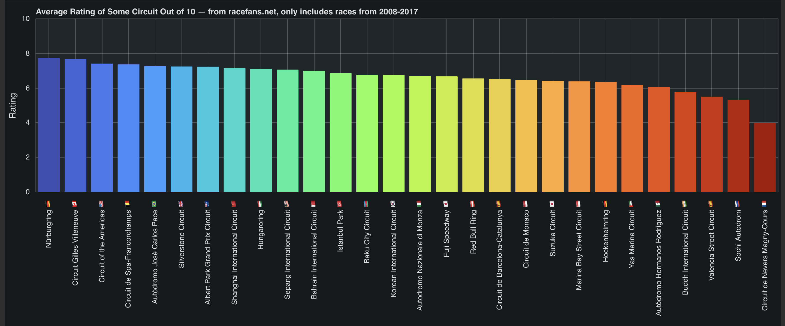

# F1Viz
This is the source code for https://f1viz.herokuapp.com/. 
Please note that because I use a free Heroku cluster, that website will be very slow to respond.
To run locally, clone, install dependencies (see `requirements.txt`), and then type `bokeh serve src` while in the root folder.
The website usage itself is pretty self-explanatory.

This website is built using Bokeh running on Tornado.

Here are some screenshots of a few different graphs and figures:

